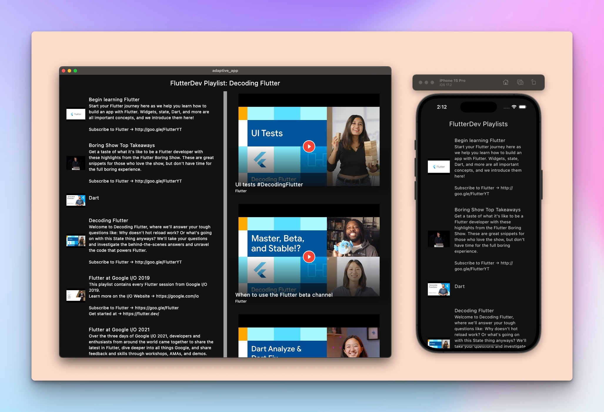

# adaptive_app

An example project demonstrating adaptive layouts in Flutter.




## Getting Started

1. Clone this repo

```
git clone https://github.com/flutterph/codelabs_adaptive_apps
```

2. Create a Youtube Data V3 API Key

First, create an API key as documented in the codelabs in [Step 3](https://codelabs.developers.google.com/codelabs/flutter-adaptive-app#3).

You can also create the API key [in the console](https://console.cloud.google.com/projectcreate) directly.

Last, replace the `youTubeApiKey` in `lib/main.dart`.

```
const youTubeApiKey = 'YOUR_API_KEY' // replace this
```

3. Run the project

Check available devices:

```
flutter devices
```

Run app in a specific device:

```
flutter run -d macos
```

Run app in all available devices:

```
flutter run -d all
```

### Contact

If you think something is not working or can be improved, feel free to file an issue or reach out to us at [team@flutter.ph](mailto:team@flutter.ph).
